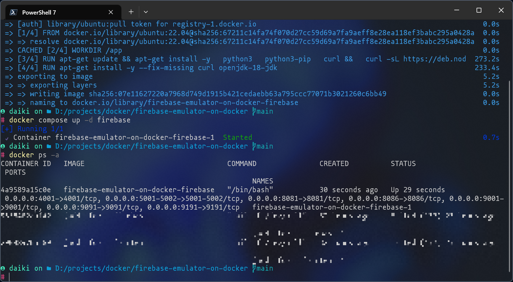
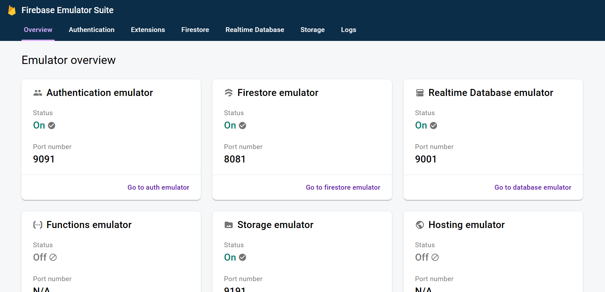

# Firebase Local Emulator Suite on Docker

## Introduction

Setup to build [Firebase Local Emulator Suite](https://firebase.google.com/docs/emulator-suite) in a Docker container.

:warning: Not tested on Mac and Linux Desktop. :warning:
:warning: WSL2 is turned on. :warning:

## Requirements

- [Docker](https://www.docker.com/) - The author installed Docker Desktop in a windows environment.
- Create a Firestore table in [Firebase project](https://firebase.google.com/)
- [Git](https://git-scm.com/downloads) - The author installed **Git for Windows** in a windows environment.

## Usage

### 1. git clone

Clone this project to any local directory.

```shell
$ git clone 
```

Change directory.

```shell
$ cd firebase-emulator-on-docker
```

### 2. docker compose build --no-cache

Build using the `docker compose` command.
It will take some time.

```shell
$ docker compose build --no-cache
```

### 3. docker compose up -d firebase

Start the container from the built image.

```shell
$ docker compose up -d firebase
```

### 4. docker ps -a

Check the container ID of the launched container.  
I have the `-a` option because I want to show all containers. If you have a large number of containers, it would be easier to see them if you remove the `-a` option and show only the containers that are running.




```shell
$ docker ps -a
```
or
```shell
$ docker ps
```

### 5. docker exec -it CONTAINER-ID /bin/bash

Enter the container.

:warning: For this container ID, enter the container ID that you have confirmed with your `docker ps -a`.

```shell
docker exec -it 4a9589a15c0e /bin/bash
```

For example, we can execute commands from the host machine to the container with `docker compose run --rm firebase firebase login --no-localhost`, but the last command `docker compose run --rm firebase firebase emulators:start` does not work correctly.  

:pray: If you know how to run it from the host machine, please let me know.

### 6. firebase --version

The following steps are performed within the container.

Verify that the `firebase` command is available.

```shell
$ firebase --version
```

### 7. firebase login --no-localhost

Firebase authentication is done locally.

```shell
$ firebase login --no-localhost
```

Open the URL shown in this step and paste the authentication code into the terminal after confirming the session ID.

```
2. Visit the URL below on any device and follow the instructions to get your code:
```

### 8. firebase init emulators

In this case, since it is Emulators, initialize by specifying Emulators. If you want to initialize other services at the same time, execute the `firebase init` command and select the services you want to initialize.

```shell
$ firebase init emulators
```

1. Please select an option: - `Use an existing project`
2. Select a default Firebase project for this directory: - `Select an existing project that you want to use in Emulators.`
3. Which Firebase emulators do you want to set up? Press Space to select emulators, then Enter to confirm your choices. - `All should be selected since firebase.json is read.`
4. Would you like to download the emulators now? - `Select Yes. Since Yes is selected by default, press Enter.`

Download Emulators for various services.

### 9. firebase emulators:start

Launch Emulators.

Open `http://127.0.0.1:4001/` in your browser.

```shell
$ firebase emulators:start
```



## License

[MIT](./LICENSE)

## Author

Daiki Nakashima