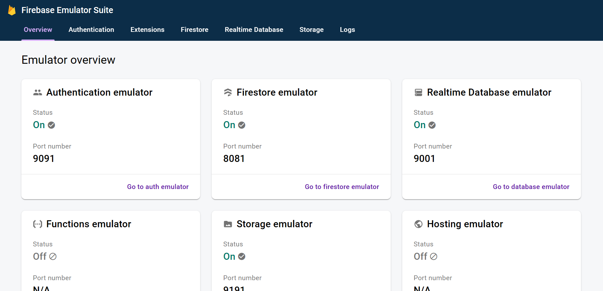

# Firebase Local Emulator Suite on Docker

## はじめに

Dockerコンテナに[Firebase Local Emulator Suite](https://firebase.google.com/docs/emulator-suite)をセットアップしました。

WindowsとMacは動作確認済み。

:warning: Linux Desktopでは動作未確認。 :warning:  
:warning: WSL2はONにしています。 :warning:

## 事前準備

- [Docker](https://www.docker.com/) - **Docker Desktop** をダウンロード済み。
- [Firebase project](https://firebase.google.com/)を作成済み。
- [Git](https://git-scm.com/downloads)をダウンロード済み。

## 実行手順

### 1. git clone

windowsであればPowershell7、macであれば標準ターミナルやiTerm2などを起動して任意のプロジェクト作成ディレクトリへ移動してクローンします。

```shell
$ git clone https://github.com/Daiki48/firebase-emulator-on-docker.git
```

`cd`コマンドでクローンしたディレクトリへ移動します。

```shell
$ cd firebase-emulator-on-docker
```

### 2. docker compose build --no-cache

`docker compose`コマンドでビルドします。`--no-cache`はキャッシュを利用せずにビルドするオプションです。  
ビルドには少々時間がかかります。

```shell
$ docker compose build --no-cache
```

### 3. docker compose up -d firebase

ビルドしたイメージからコンテナを起動します。

```shell
$ docker compose up -d firebase
```

### 4. docker ps -a

コンテナIDを確認します。`-a`オプションは、存在するコンテナ全てを表示するオプションです。起動済みのコンテナを確認する場合は`-a`を外してください。


```shell
$ docker ps -a
```

or

```shell
$ docker ps
```

### 5. docker exec -it CONTAINER-ID /bin/bash

コンテナに入ります。

:warning: コンテナIDは`docker ps -a`で確認してください。

```shell
$ docker exec -it 4a9589a15c0e /bin/bash
```

:warning: 最後にエミュレータを起動する際、`docker compose run --rm firebase firebase emulators:start`コマンドだとブラウザからUIを確認出来ませんでした。  
firebase認証などはホストマシンからも`docker compose run --rm firebase firebase login --no-localhost`コマンドで実行可能です。

:pray: 原因が分かる方いらっしゃったらぜひ教えてください・・・

### 6. firebase --version

これ以降の処理はコンテナ内の`bash`で実行します。

`firebase`コマンドを使用できるか確認します。

```shell
$ firebase --version
```

### 7. firebase login --no-localhost

firebase認証をローカルで行います。

```shell
$ firebase login --no-localhost
```

上記コマンドを実行して最初の(Y/n)は任意の選択をし、その後表示されるURLをブラウザで開きます。  
セッションIDが同じことを確認して認証コードをターミナルに貼り付けます。

```
2. Visit the URL below on any device and follow the instructions to get your code:
```

### 8. firebase init emulators

firebaseサービスの初期化を行います。今回はemulatorsのみ初期化したいので`firebase init emulators`と指定していますが、`firebase init`コマンドを実施してその後サービスを選択しても大丈夫です。

```shell
$ firebase init emulators
```

1. Please select an option: - `Use an existing project`
2. Select a default Firebase project for this directory: - `Select an existing project that you want to use in Emulators.`
3. Which Firebase emulators do you want to set up? Press Space to select emulators, then Enter to confirm your choices. - `All should be selected since firebase.json is read.`
4. Would you like to download the emulators now? - `Select Yes. Since Yes is selected by default, press Enter.`

エミュレータのダウンロードが実行されます。

### 9. firebase emulators:start

エミュレータを起動します。

ブラウザで`http://127.0.0.1:4001/`を開きます。  

```shell
$ firebase emulators:start
```

下記のようにエミュレータが表示されます。



## License

[MIT](./LICENSE)

## Author

Daiki Nakashima